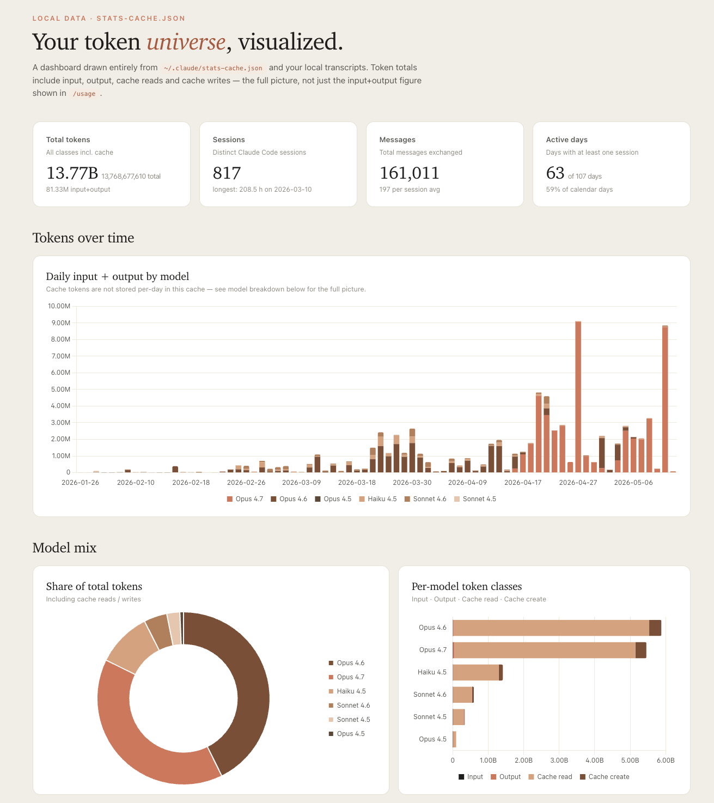
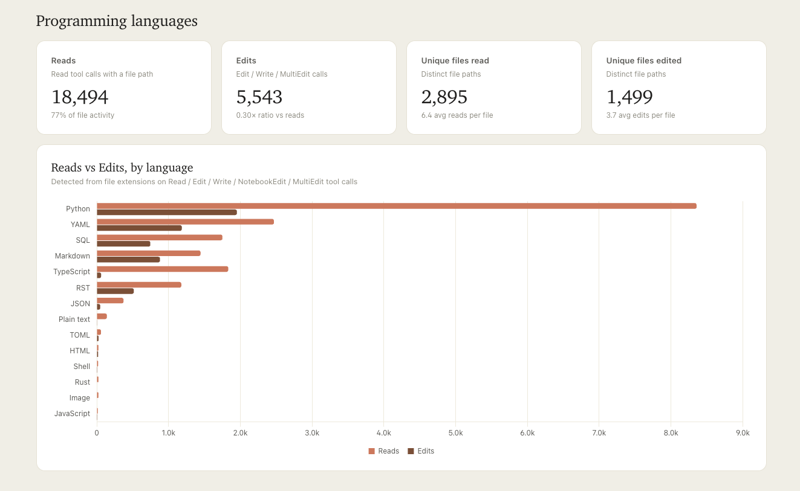

# Claude Code Token Universe

> A local, single-file HTML dashboard for [Claude Code](https://claude.com/claude-code) usage — token totals (input, output, cache reads, cache creates), per-model breakdowns, MCP server activity, web research history, programming-language frequency, and an AI-clustered word cloud of your search themes.

[](https://www.python.org/)
[](https://docs.astral.sh/uv/)
[](#license)
[](#privacy)
[](#quick-start)



The whole product is one Python script — `claude_usage.py` — runnable directly
with [uv](https://docs.astral.sh/uv/) so dependencies are resolved
automatically. No `pip install`, no virtualenv, no server, no account.

---

## Why this exists

Anthropic's `/usage` command in Claude Code reports raw input + output tokens,
but does not surface **cache reads and cache writes** — which on a heavy Opus
session are typically 5-50× larger than the headline figure. This tool reads
the local `~/.claude/stats-cache.json` and your transcript JSONL files, then
renders the **full picture** as a single self-contained HTML file you can
open, share, or export to PDF.

It is useful if you want to:

- **See how much you've actually spent in tokens** across all classes (input, output, cache read, cache create) — not just the partial figure shown in `/usage`.
- **Compare Claude Code model usage** (Opus 4.5 / 4.6 / 4.7, Sonnet 4.5 / 4.6, Haiku 4.5) and see which sessions burned which model.
- **Audit MCP server activity** — which tools your agents called, how often, on which days.
- **Review your web research history** — top domains visited via WebFetch, top keywords searched via WebSearch, themes clustered via Claude Haiku.
- **Catch heavy-language drift** — which file types Claude reads and edits most often, by extension.
- **Produce a shareable PDF** for retros, blog posts, or expense reports — without uploading anything to a third-party.

## Features

- **Zero install.** Single `uv run claude_usage.py ~/.claude` produces `claude_usage_dashboard.html` in the working directory.
- **Token universe view.** All four token classes (input, output, cache read, cache create) per model, with daily and monthly aggregates.
- **MCP server analytics.** Per-server tool-call counts, distinct tools used, and daily activity charts. Auto-detects top-N servers or accepts an explicit list.
- **Web research map.** Top WebFetch domains, top WebSearch keywords, daily research volume, and AI-clustered themes via 4 parallel `claude -p --model haiku` calls.
- **Programming-language frequency.** Bar chart of reads / edits by language, derived from file extensions in your transcript JSONLs.

  
- **PDF export that actually works.** Uses the browser's native print engine (Chrome / Edge / Safari / Firefox) with print CSS tuned for A4 — vector text, sharp at any zoom, no clipped charts.
- **Privacy-first by design.** All parsing is local. With `--no-ai`, nothing leaves your machine.

## Quick start

```bash
# Default — generates ./claude_usage_dashboard.html
uv run claude_usage.py ~/.claude

# Pick the output path and open it in your browser when done
uv run claude_usage.py ~/.claude --output /tmp/me.html --open

# Skip the AI step (fully offline)
uv run claude_usage.py ~/.claude --no-ai

# Pick which MCP servers to show (default: top 3 by call count)
uv run claude_usage.py ~/.claude --mcp-servers databricks,serena

# Override the header title
uv run claude_usage.py ~/.claude --title "My team — Claude Code usage"
```

The final line of stdout is the path to the generated HTML, so you can pipe it:

```bash
dashboard=$(uv run claude_usage.py ~/.claude)
open "$dashboard"
```

## Requirements

- `uv` installed
  ([install](https://docs.astral.sh/uv/getting-started/installation/))
- A `.claude/` folder produced by Claude Code (defaults to `~/.claude`)
- **Optional:** the `claude` CLI on `PATH` if you want the AI-clustered word
  cloud of your search queries. Pass `--no-ai` to skip this step entirely.

## What it reads

| Path                                  | Required? | Used for                                                                      |
| ------------------------------------- | --------- | ----------------------------------------------------------------------------- |
| `<root>/stats-cache.json`             | yes       | KPIs, per-model token totals, daily I+O, hour-of-day counts                   |
| `<root>/projects/**/*.jsonl`          | yes       | Tool calls (MCP servers, WebFetch, WebSearch, research-expert subagent calls) |

Everything else under `.claude/` is ignored. The script never writes to your
`.claude/` folder.

## Privacy

- **All parsing is local.** No data is uploaded.
- **With `--no-ai`, nothing leaves your machine.** The script reads files and
  writes one HTML file. That's it.
- **Without `--no-ai`,** your WebSearch query strings are sent to Anthropic
  via the local `claude` CLI in four parallel `claude -p` calls (model:
  `haiku`). Queries are clustered into themes; raw queries do not appear in
  the rendered HTML.
- **The generated HTML loads three CDN scripts at view time**: Chart.js, d3,
  and d3-cloud, all from `jsdelivr.net`. The HTML itself does not phone home.

## Exporting to PDF

The dashboard has an **Export PDF** button in the top-right of the header.
Clicking it opens your browser's print dialog with the layout already tuned
for A4 (charts shrink to fit, cards don't split across pages, the button
itself is hidden). Choose "Save as PDF" in the destination dropdown and the
PDF lands on disk.

This uses the browser's native print engine (Chrome, Edge, Safari, Firefox)
rather than a JS-based renderer like html2pdf. Trade-offs:

- Vector text — sharp at any zoom, much smaller files
- Charts render at their final values (no animation freeze, no clipped bars)
- Page breaks respect card boundaries
- No CDN dependency for PDF generation
- Requires one extra click in the print dialog ("Save as PDF")

For programmatic / scripted PDF generation, you can also do:

```bash
chrome --headless=new --no-pdf-header-footer --print-to-pdf=out.pdf \
  "file:///path/to/claude_usage_dashboard.html"
```

## FAQ

### How do I see Claude Code token usage including cache reads?

Run `uv run claude_usage.py ~/.claude`. The KPI cards at the top show the
full total across all four token classes; the "Per-model token classes" bar
chart breaks them out by model.

### Does this work without internet access?

Generation works fully offline if you pass `--no-ai`. Viewing the generated
HTML requires internet for the three CDN-loaded chart libraries on first
view (they cache after that). A future flag will vendor them inline.

### Does it work with Claude Code on Windows / Linux / WSL?

Yes. Paths use `pathlib`, `webbrowser.open` is cross-platform, and the
generated HTML opens in any modern browser.

### Where is `stats-cache.json` if it isn't in `~/.claude`?

Pass the actual path as the first argument: `uv run claude_usage.py /path/to/your/.claude`.
The script accepts any directory containing a `stats-cache.json` plus a
`projects/` folder.

### Is this affiliated with Anthropic?

No. It is a third-party tool. See the disclaimer below.

### Can I use it for a team?

The dashboard is per-user. To produce a team view, generate one HTML per
member and concatenate the KPIs by hand — multi-user aggregation is not in
scope for v1.

## Disclaimer

Third-party tool. Not affiliated with or endorsed by Anthropic. The dashboard
mirrors Anthropic's published design language (Inter/Tiempos typography,
cream/coral palette) and includes the "Anthropic / Claude Code · Usage"
header used in their official Claude Code surface so the report feels like
the dashboards users already recognize. If you intend to redistribute output
publicly, replace the header text via `--title "Your name · Claude usage"`.

## Out of scope (for now)

- Offline HTML (vendoring Chart.js / d3 / d3-cloud inline)
- Per-project cost breakdown from `cost_cache.json`
- `--watch` mode / auto-refresh
- Cost figures from the Anthropic Admin API
- Multi-user team aggregation

## License

MIT. See `LICENSE` if present, otherwise the MIT terms at
<https://opensource.org/licenses/MIT> apply.

## Keywords

Claude · Claude Code · Anthropic · Claude Code usage · Claude Code dashboard ·
Claude Code stats · Claude Code analytics · token usage · LLM analytics ·
MCP · MCP server · Model Context Protocol · WebSearch · WebFetch ·
self-hosted · privacy-first · local-first · uv · Python · Chart.js · d3
